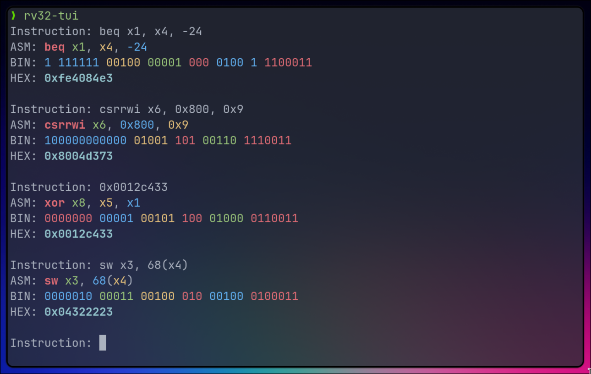

# RISC-V 32-bit instruction encode/decode tool

A simple tool to encode and decode RISC-V 32-bit instructions. For now, only non-ABI instructions are supported.



### Installation:
Using cargo:
```sh
cargo install --git https://github.com/ant1isbusy/rv32-tui
```

##### TODO
- create --tui and --cli options
- add usage examples
- add unit tests
- add more instructions
- add ABI support
