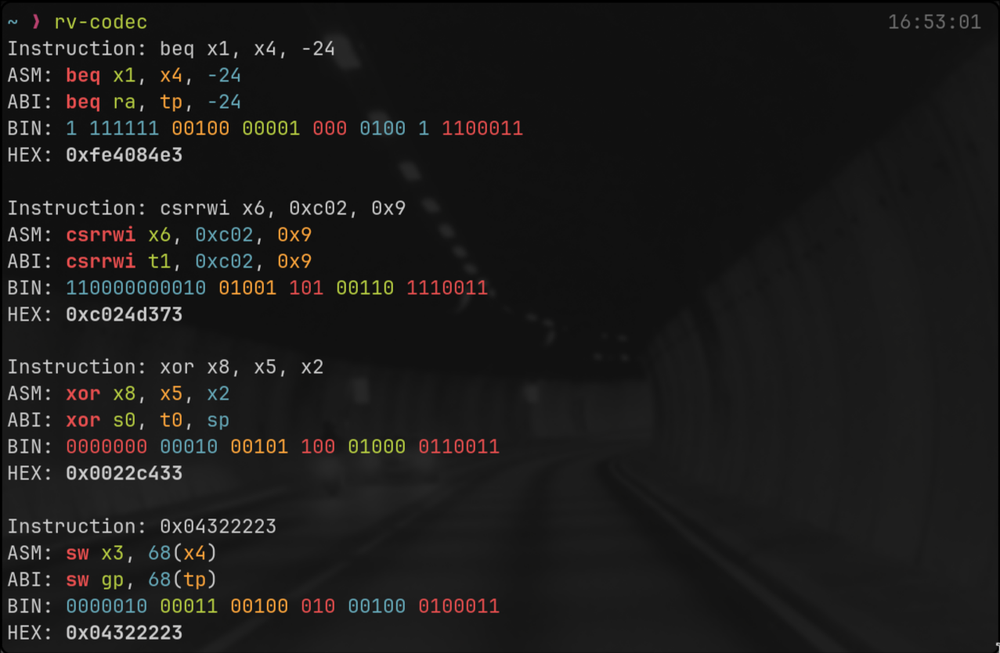

# RISC-V 32-bit instruction encode/decode tool

A simple tool to encode and decode RISC-V 32-bit instructions.



### Installation

Using cargo:

```sh
cargo install --git https://github.com/ant1isbusy/riscv-codec-rs
```

To use, call:

```sh
rv-codec
```

##### TODO

- add more instructions
- add verbose option which shows how register fields are arranged.
